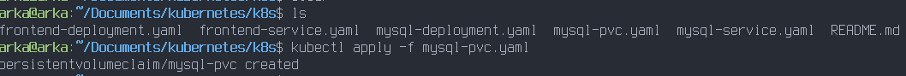

# Question 1 - TP2

L'objectif de cette question est de déployer une application web à deux niveaux
avec une base de données et un frontend, en utilisant kubernetes.  
Pour cela, des déploiements, des services et volumes persistans seront utilisés.  

## Déploiement

Le volume persistant doit être créer en premier afin que le déploiement mysql
puisse l'utiliser.  

```bash
kubectl apply -f k8s/mysql-pvc.yaml
```


  
Ensuite, le déploiement et le service mysql peuvent être ajouter.  
  
```bash
kubectl apply -f k8s/mysql-deployment.yaml
kubectl apply -f k8s/mysql-service.yaml
```
   
Avant de déployer le frontend, il est nécessaire de s'assurer que le déploiement
mysql fonctionne correctement.
  
```bash
kubectl get deployments
kubectl get services
```
  
  

Le frontend peut maintenant être déployer.  
  
```bash
kubectl apply -f k8s/frontend-deployment.yaml
kubectl apply -f k8s/frontend-service.yaml
```
  

  
Le bon fonctionnement du déploiement peut être vérifier avec les commandes suivantes:
  
```bash
kubectl get deployments
kubectl get services
```
  
## Accéder à l'application

Afin de pouvoir accéder à l'application, un nodePort doit être configuré dans
le fichier `k8s/frontend-service.yaml`, ici le port de sorti est `30080`.
  
Il existe plusieurs manières de pouvoir récupérer l'adresse ip du noeuds hébergeant
notre service.  
  
```bash
kubectl get nodes -o wide
```
  
Qui permettra de récupérer l'adresse ip du noeud, puis d'y ajouter notre nodeport.  
Ou bien directement avec la commande suivante.
  
```bash
minikube service frontend-service --url
```


## Nettoyage

Pour nettoyer, il suffit d'arrêter tous les déploiements, services et volumes
persistents.  
  
```bash
kubectl delete -f k8s/frontend-service.yaml
kubectl delete -f k8s/frontend-deployment.yaml
kubectl delete -f k8s/mysql-service.yaml
kubectl delete -f k8s/mysql-deployment.yaml
kubectl delete -f k8s/mysql-pvc.yaml
```  
  

  
Puis d'arrêter minikube.  
  


## Explication du type NodePort avec un exemple

Le type nodePort est une manière d'exposer un service à l'extérieur d'un cluster
kubernetes.  
Pour cela un port entre `30000` et `32767` est allouer par nodePort sur chaque
noeud du cluster, pour chaque service de type NodePort.  
Ce port est accessible aux machines qui peuvent accéder au noeud, et permet l'échange
de trafic via ce port entre une machine externe au cluster kubernetes et un pod interne.
  
Dans le cas de notre application, un serveur flask expose le port 5000 dans un pod.  
Ce pod est déployé par `k8s/frontend-deployment.yaml`, et dans la configuration
`k8s/frontend-service.yaml`, l'utilisation de `spec.ports.port: 5000` permet de 
dire que le port 5000 du pod sera exposé en tant que port 5000 dans le cluster.  
Ensuite, le NodePort permet d'exposer ce port sur le réseau externe du cluster.

